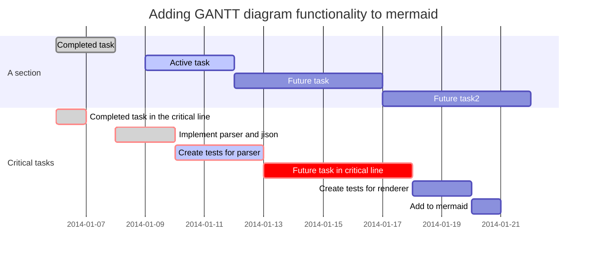

# pandoc-mermaid-filter

Pandoc filter which converts mermaid code blocks to mermaid images.

````

````

## Usage

Install it with pip:

```
pip install pandoc-mermaid-filter
```

And use it like any other pandoc filter:

```
pandoc tests/sample.md -o sample.pdf --filter pandoc-mermaid
```

The mermaid binary must be in your `$PATH` or can be set with the
`MERMAID_BIN` environment variable.

## But there is ...

There are a few other filters trying to convert mermaid code blocks however
they all failed for me.

### Troubleshoot

I've had to install the mermaid CLI locally instead of globally. See https://github.com/mermaidjs/mermaid.cli/issues/16
